# 使用Android Studio对代码进行重构

---

# 简介

2013年Google I/O大会上，谷歌推出新的Android开发环境——Android Studio，从此Android程序员有了新的选择，使用Android Studio进行App开发。AndroidStudio是一项全新的基于IntelliJ IDEA的Android开发环境。类似于Eclipse ADT插件，现在已经成为了官方推荐的ide，同时Eclipse不再进行更新。

软件开发中，经过几个版本迭代，不少程序员会觉的以前的代码架构可能不满足日益增长的需求，这时候都会想到了重构，关于重构网上也有不少用于的资料。

[重构资料](http://blog.csdn.net/knightswarrior/article/details/9447815)

资料里面列举了如下几种方法，对代码进行重构。

```
31天重构学习笔记01. 封装集合
31天重构学习笔记02. 移动方法
31天重构学习笔记03. 提升方法
31天重构学习笔记04. 降低方法
31天重构学习笔记05. 提升字段
31天重构学习笔记06. 降低字段
31天重构学习笔记07. 重命名（方法，类，参数）
31天重构学习笔记08. 使用委派代替继承
31天重构学习笔记09. 提取接口
31天重构学习笔记10. 提取方法
31天重构学习笔记11. 使用策略类
31天重构学习笔记12. 分解依赖
31天重构学习笔记13. 提取方法对象
31天重构学习笔记14. 分离职责
31天重构学习笔记15. 移除重复内容
31天重构学习笔记16. 封装条件
31天重构学习笔记17. 提取父类
31天重构学习笔记18. 使用条件判断代替异常
31天重构学习笔记19. 提取工厂类
31天重构学习笔记20. 提取子类
31天重构学习笔记21. 合并继承
31天重构学习笔记22. 分解方法
31天重构学习笔记23. 引入参数对象
31天重构学习笔记24. 分解复杂判断
31天重构学习笔记25. 引入契约式设计
31天重构学习笔记26. 避免双重否定
31天重构学习笔记27. 去除上帝类
31天重构学习笔记28. 为布尔方法命名
31天重构学习笔记29. 去除中间人对象
31天重构学习笔记30. 尽快返回
31天重构学习笔记31. 使用多态代替条件判断
```
Android Studio是基于优秀的ide的，ide提供了丰富的功能，很方便的对代码进行重构，下图是我的Android Studio Refactor菜单，部分快捷键与默认快捷键不同是因为方便而修改的。

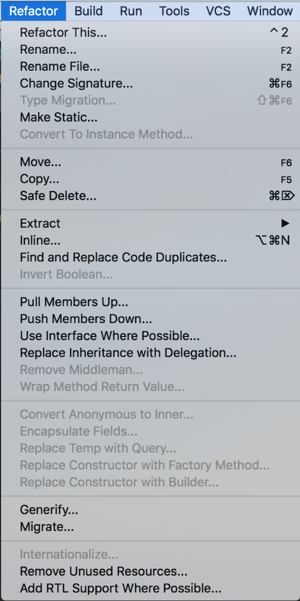

古人云『工欲善其事必先利其器』，所以在对代码进行重构前，需要详细了解Android Studio提供的功能，下面对AS(Android Studio，后面简称AS)菜单进行简单示例。

## 如何使用

鼠标光标选中或者放在代码上，按下快捷键就可以弹出当前代码可以使用的功能。
如下所示：

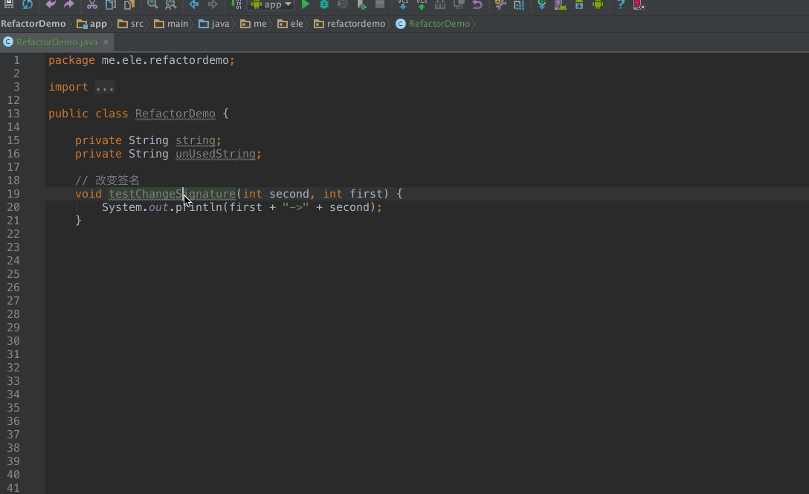

## 代码与操作示例

* ChangeSignature，改变函数签名，可以修改函数的名字，参数的顺序，参数的名字。

Before:

```
    // 改变签名
    void testChangeSignature(int second, int first) {
        System.out.println(first + "->" + second);
    }
```
Gif:

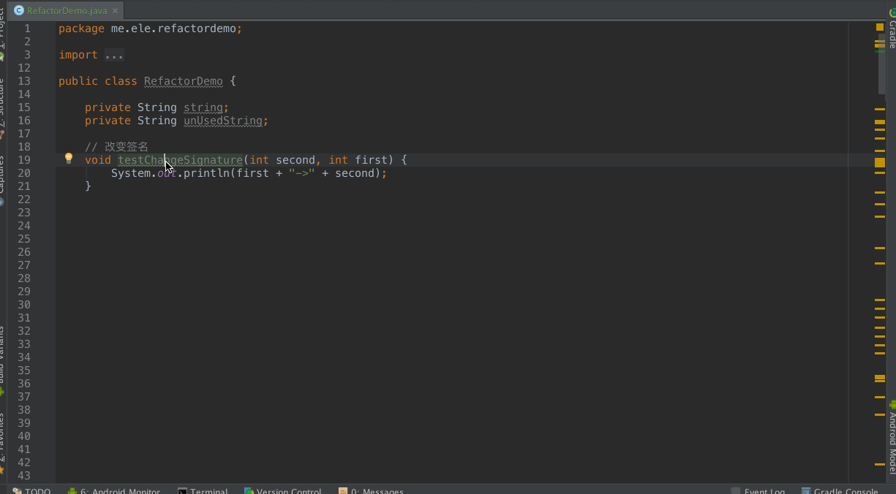

After:

```
    // 改变签名
    void testChangeSignature(int one, int two) {
        System.out.println(one + "->" + two);
    }
```
修改前参数依次是second、first，修改是one、two。

* ChangeClassSignatuere，改变类的签名，可以修改类的泛型签名

Before：

```
    // 改变类的签名
    void testChangeClassSignatuere() {
        String second = "second";
        int first = 100;
        new ChangeClassSignatuere(second, first);
    }
    
// **********************分割线*******************************    
    
public class ChangeClassSignatuere {

    private int first;
    private String second;

    public ChangeClassSignatuere(String second, int first) {
        this.first = first;
        this.second = second;
    }

    @Override
    public String toString() {
        return "ChangeClassSignatuere{" +
                "second='" + second + '\'' +
                ",first=" + first +
                '}';
    }
}    
```
Gif:

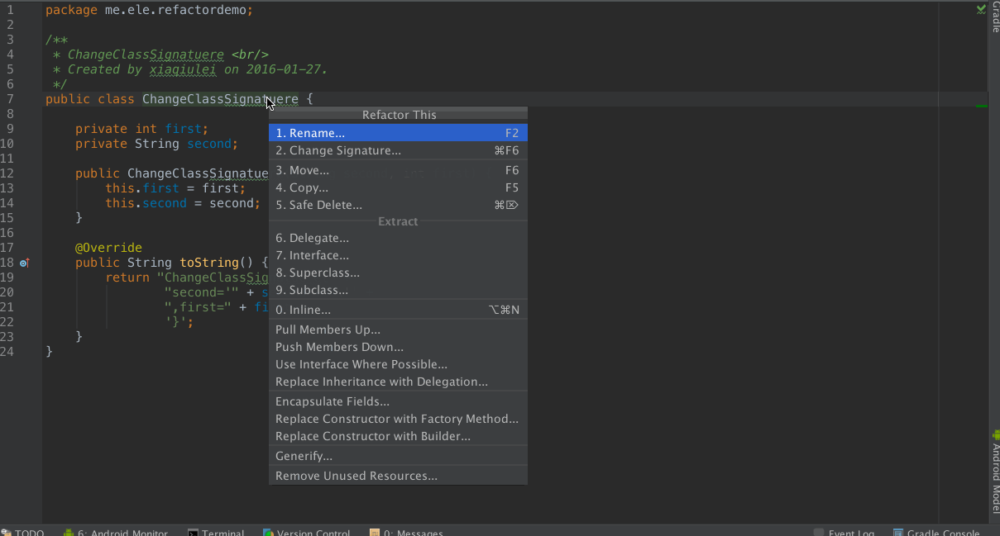

After：

```
    // 改变类的签名
    void testChangeClassSignatuere() {
        String second = "second";
        int first = 100;
        new ChangeClassSignatuere<Activity>(second, first);
    }
// **********************分割线*******************************    

public class ChangeClassSignatuere<A> {

    private int first;
    private String second;

    public ChangeClassSignatuere(String second, int first) {
        this.first = first;
        this.second = second;
    }

    @Override
    public String toString() {
        return "ChangeClassSignatuere{" +
                "second='" + second + '\'' +
                ",first=" + first +
                '}';
    }
}
```
* 修改匿名类为内部类

Before：

```
    // 匿名类改成内部类
    void testConvertAnonymousToInner() {
        View.OnClickListener clickListener = new View.OnClickListener() {

            @Override
            public void onClick(View v) {
                System.out.println("onClick");
            }
        };
    }
```
Gif:

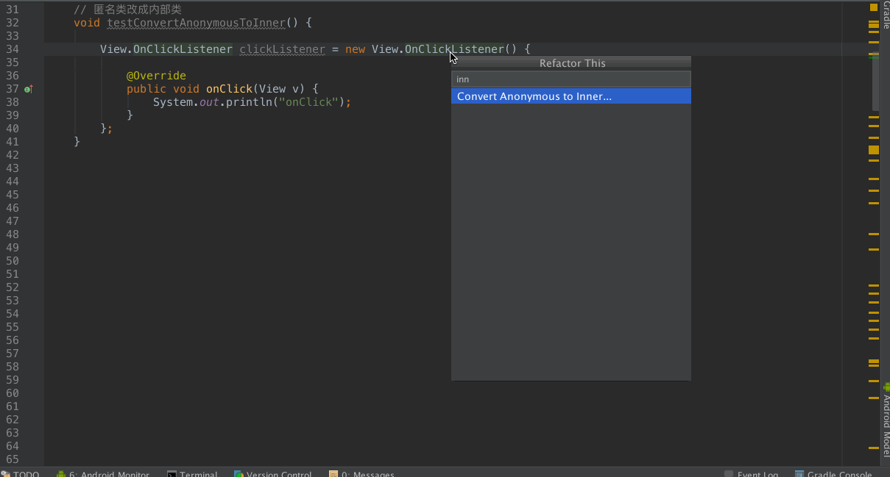

After:

```
    // 匿名类改成内部类
    void testConvertAnonymousToInner() {

        View.OnClickListener clickListener = new Abc123();
    }
    
    private static class Abc123 implements View.OnClickListener {

        @Override
        public void onClick(View v) {
            System.out.println("onClick");
        }
    }
```
这个是我最喜欢的一个功能，有时候匿名类刚刚开始逻辑很简单，过不了多久逻辑太多，就可以使用快捷键变成一个内部类。

* ConvertToInstanceMethod，修改一个方法变成成员方法

Befor:

```
    // 变成成员方法
    void testConvertToInstanceMethod() {
        TestClass.convertToInstanceMethod(this, "test");
    }
    
public class TestClass {

    static void convertToInstanceMethod(RefactorDemo demo, String string) {
        System.out.println("convertToInstanceMethod = " + demo);
        System.out.println("convertToInstanceMethod = " + string);
    }
}    
```
After:

```
    // 变成成员方法
    void testConvertToInstanceMethod() {
        this.convertToInstanceMethod("test");
    }
    
    void convertToInstanceMethod(String string) {
        System.out.println("convertToInstanceMethod = " + this);
        System.out.println("convertToInstanceMethod = " + string);
    }

```
在修改前，调用convertToInstanceMethod方法，第一个参数相是RefactorDemo，传递是this， 修改后就那个方法直接移动到本类中。

* Copy，复制一个类

Before:

```
    // 复制一个类
    void testCopy() {
        new FirstClass();
    }
    
public class FirstClass implements Serializable {

    public String first;

    @Override
    public String toString() {
        return "FirstClass{" +
                "first='" + first + '\'' +
                '}';
    }
}
```

Gif:

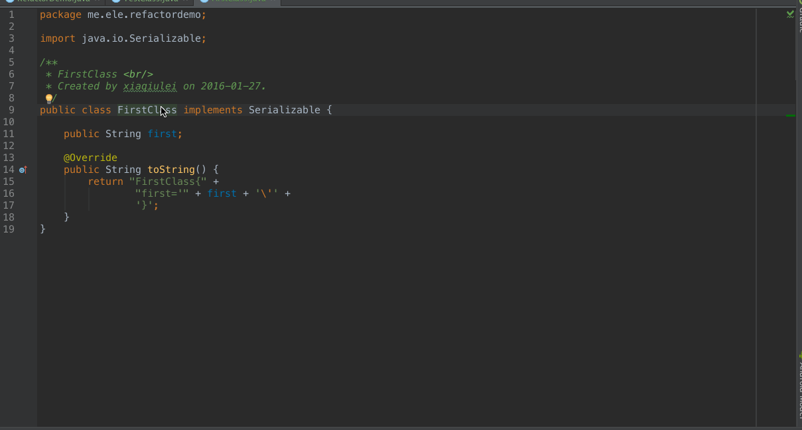

After:

```
public class SecondClass implements Serializable {

    public String first;

    @Override
    public String toString() {
        return "SecondClass{" +
                "first='" + first + '\'' +
                '}';
    }
}
```

* EncapsulateFields，压缩一个字段，间接访问

Before:

```
    String filed = "filed";

    // 压缩一个字段，间接访问
    void testEncapsulateFields() {
        System.out.println(filed);
    }
```

After:

```
    private String filed = "filed";

    // 压缩一个字段，间接访问
    void testEncapsulateFields() {
        System.out.println(getFiled());
    }
    
    public String getFiled() {
        return filed;
    }

    public void setFiled(String filed) {
        this.filed = filed;
    }
```
相当于简介访问一个field，自动生成setter和getter。

* GenerifyRefactoring，泛型重构

Before:

```
    // 泛型重构
    void testGenerifyRefactoring() {
        List list = new ArrayList();
        list.add("one");
        list.add("two");
        list.add("three");
    }
```
After:

```
    // 泛型重构
    void testGenerifyRefactoring() {
        List<String> list = new ArrayList<String>();
        list.add("one");
        list.add("two");
        list.add("three");
    }
```

自动添加泛型的参数。

* Inline，内联函数

Before:

```
    // 内联
    void testInline() {
        int a = 100;
        int b = 200;
        System.out.println(add(a, b));
    }

    int add(int a, int b) {
        return a + b;
    }
```

Gif:

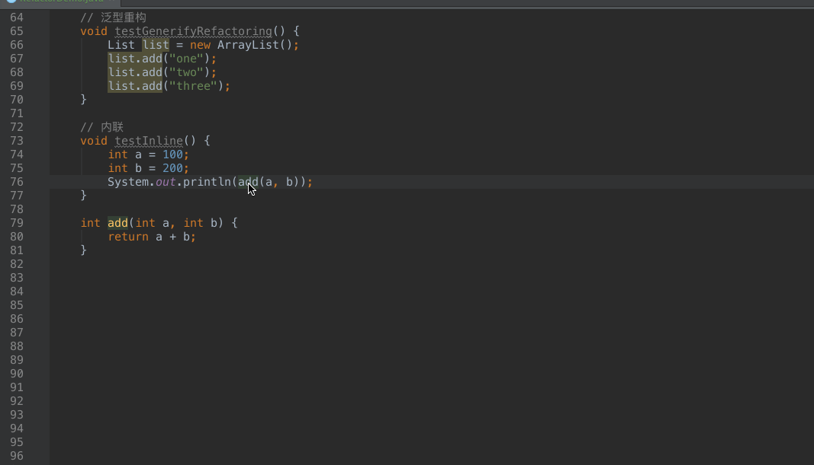

After:

```
    // 内联
    void testInline() {
        int a = 100;
        int b = 200;
        System.out.println(a + b);
    }

```
原先需要调用一个函数的地方，直接把那个函数里面的代码复制过来。

* InvertBoolean，重构Boolean

Before:

```
    // 重构Boolean
    void testInvertBoolean() {
        System.out.println(checkPaswd(null));
        System.out.println(checkPaswd(""));
        System.out.println(checkPaswd("admin"));
    }

    boolean checkPaswd(String passwd) {
        if (passwd != null && passwd.length() != 0) {
            return true;
        }
        return false;
    }
```

Gif:

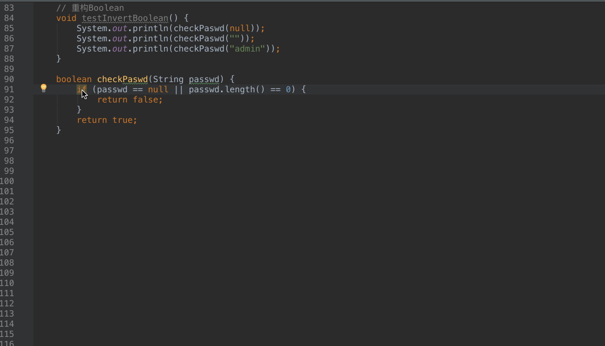

After:

```
    // 重构Boolean
    void testInvertBoolean() {
        System.out.println(checkPaswd(null));
        System.out.println(checkPaswd(""));
        System.out.println(checkPaswd("admin"));
    }

    boolean checkPaswd(String passwd) {
        return passwd != null && passwd.length() != 0;
    }
```


* MakeClassStatic，使类变成静态的

Before:

```
    // 使类变成静态的
    void testMakeClassStatic() {
        new MyClass().fun();
    }

    String myClassField = "abc";

    class MyClass {
        void fun() {
            System.out.println("myClassField = " + myClassField);
        }
    }
```

Gif:

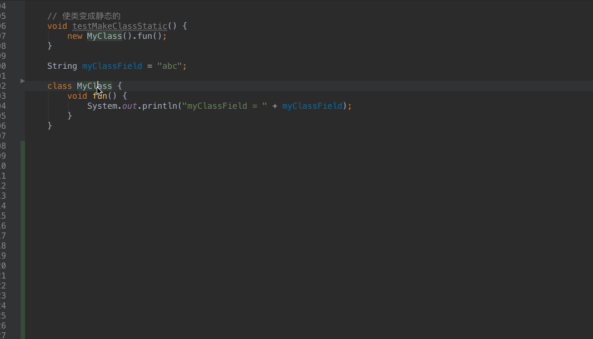

After:

```
    // 使类变成静态的
    void testMakeClassStatic() {
        new MyClass(myClassField).fun();
    }

    String myClassField = "abc";

    static class MyClass {
        private String myClassField;

        public MyClass(String myClassField) {
            this.myClassField = myClassField;
        }

        void fun() {
            System.out.println("myClassField = " + myClassField);
        }
    }
```
修改前需要调用外部内的成员变量myClassField，实际编译过后MyClass的class是持有外部类的对象，这样才能访问myClassField，通过重构，使得myClassField通过构造方法传入进去，然后再在fun方法中使用，这样重构会减少类的依赖。

* MakeMethodStatic，使方法变成静态的

Before:

```
    // 使方法变成静态的
    void testMakeMethodStatic() {
        myFun();
    }

    void myFun() {
        System.out.println("myFun");
    }
```
After:

```
    // 使方法变成静态的
    void testMakeMethodStatic() {
        myFun();
    }

    static void myFun() {
        System.out.println("myFun");
    }
```

* Move，移动一个类

Before:

```
    // 移动一个类
    void testMove() {
        new MoveClass().fun();
    }

    static class MoveClass {

        String movde;

        @Override
        public String toString() {
            return "MoveClass{" +
                    "movde='" + movde + '\'' +
                    '}';
        }

        void fun() {
            System.out.println(this);
        }
    }
```

Gif:

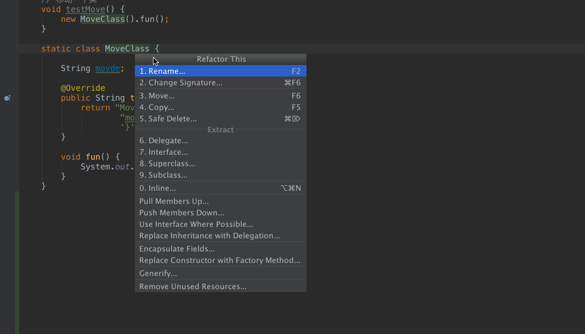

After:

```
    // 移动一个类
    void testMove() {
        new MoveClassxxxxxx().fun();
    }
    
class MoveClassxxxxxx {

    String movde;

    @Override
    public String toString() {
        return "MoveClass{" +
                "movde='" + movde + '\'' +
                '}';
    }

    void fun() {
        System.out.println(this);
    }
}    
```

* PullMenmberUp，上移

Before:

```
public class Base {

    public String baseString;

    public Base(String baseString) {
        this.baseString = baseString;
    }

    public void funBase() {
        System.out.println(baseString);
    }
}
public class Sub extends Base {


    public Sub(String baseString) {
        super(baseString);
    }

    public void funSub() {
        System.out.println(baseString);
    }
}

    // 上移
    void testPullMenmberUp() {
        new Sub("base").funSub();
    }
```

Gif:

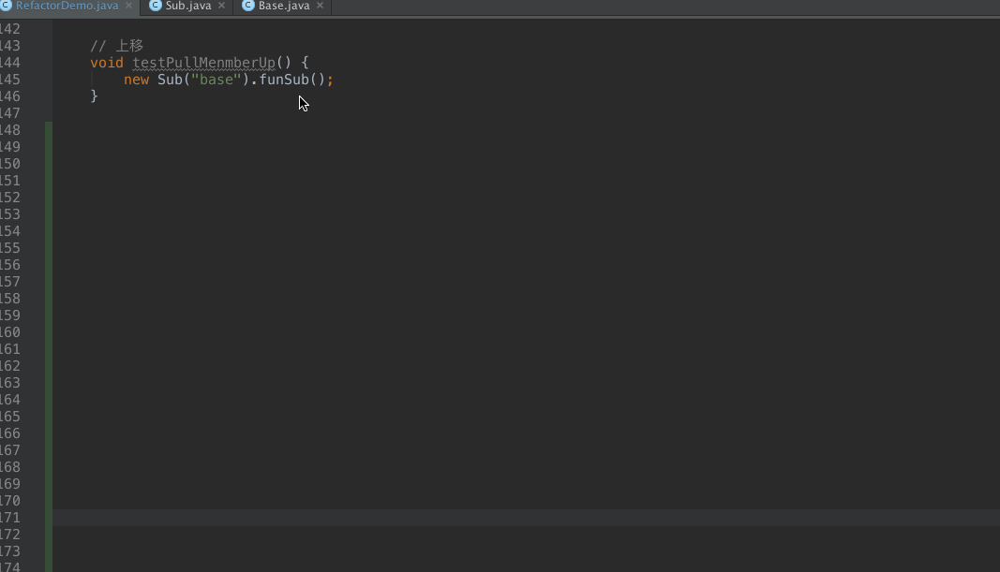

After:

```
public class Base {

    public String baseString;

    public Base(String baseString) {
        this.baseString = baseString;
    }

    public void funBase() {
        System.out.println(baseString);
    }

    public void funSub() {
        System.out.println(baseString);
    }
}

public class Sub extends Base {


    public Sub(String baseString) {
        super(baseString);
    }

}
```
实际上就是把子类中的方法移动到父类中。

* PullMenmberDown，下移

Before:

```
public class Base {

    public String baseString;

    public Base(String baseString) {
        this.baseString = baseString;
    }

    public void funBase() {
        System.out.println(baseString);
    }
}
public class Sub extends Base {


    public Sub(String baseString) {
        super(baseString);
    }

    public void funSub() {
        System.out.println(baseString);
    }
}
    // 下移
    void testPullMenmberDown() {
        new Sub("base").funBase();
    }
```
After:

```
public class Base {

    public String baseString;

    public Base(String baseString) {
        this.baseString = baseString;
    }

}

public class Sub extends Base {

    public Sub(String baseString) {
        super(baseString);
    }

    public void funSub() {
        System.out.println(baseString);
    }

    public void funBase() {
        System.out.println(baseString);
    }
}
```
实际上就是把父类中的方法移动到子类中。

* Rename，重命名

这个功能也是我最喜欢的，只要选择重命名一个对象或者资源，所有使用到这个对象或者资源的地方，都会进行重新命名。

Before:

```
    // 重命名
    void testRename() {
        String first = "second";
        System.out.println(first);
    }
```

Gif:

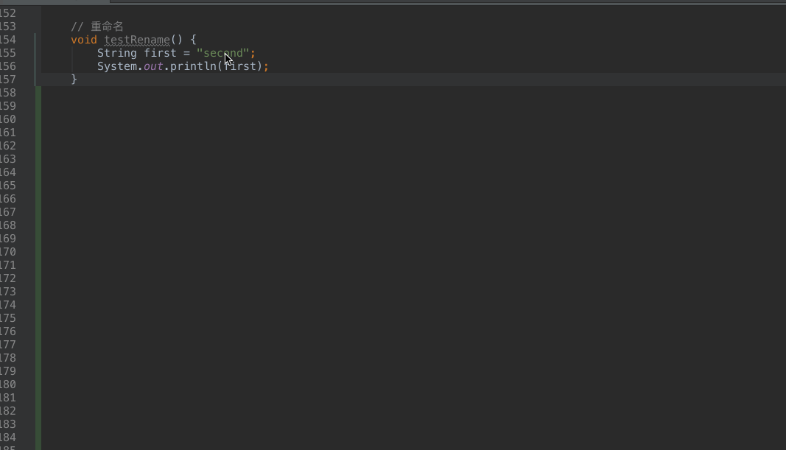

After:

```
    // 重命名
    void testRename() {
        String second = "second";
        System.out.println(second);
    }
```

* ReplaceConstructorWithBuilder，构造方法变成builder

还在羡慕Picasso，Fresco人性化调用方式吗？很简单，通过这个功能就可以快速生成代码

Before:

```
public class MyAlertDialog {

    private String title;
    private String message;
    private String okButton;
    private String cancelButton;

    public MyAlertDialog(String title, String message, String okButton, String cancelButton) {
        this.title = title;
        this.message = message;
        this.okButton = okButton;
        this.cancelButton = cancelButton;
    }
}    
    // 构造方法变成builder
    void testReplaceConstructorWithBuilder() {
        new MyAlertDialog("title", "message", "ok", "cancel").show();
    }
```

Gif:

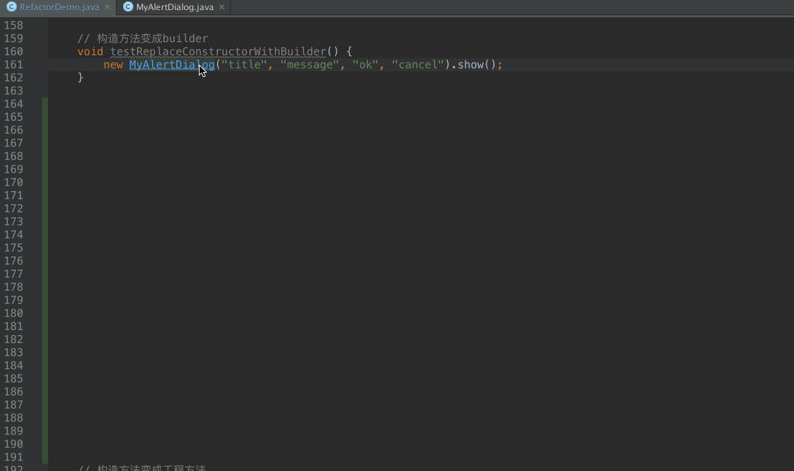

After:

```
    // 构造方法变成builder
    void testReplaceConstructorWithBuilder() {
        new MyAlertDialog.Builder()
                .setTitle("title")
                .setMessage("message")
                .setOkButton("ok")
                .setCancelButton("cancel")
                .createMyAlertDialog()
                .show();
    }
    
public static class Builder {
    private String title;
    private String message;
    private String okButton;
    private String cancelButton;

    public Builder setTitle(String title) {
        this.title = title;
        return this;
    }

    public Builder setMessage(String message) {
        this.message = message;
        return this;
    }

    public Builder setOkButton(String okButton) {
        this.okButton = okButton;
        return this;
    }

    public Builder setCancelButton(String cancelButton) {
        this.cancelButton = cancelButton;
        return this;
    }

    public MyAlertDialog createMyAlertDialog() {
        return new MyAlertDialog(title, message, okButton, cancelButton);
    }
}
```

* ReplaceConstructorWithFactory，构造方法变成工程方法

Before:

```
    // 构造方法变成工程方法
    void testReplaceConstructorWithFactory() {
        new MyAlertDialog("title", "message", "ok", "cancel").show();
    }
```

Gif:

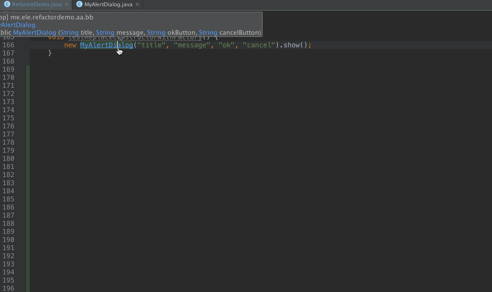

After:

```
    // 构造方法变成工程方法
    void testReplaceConstructorWithFactory() {
        MyAlertDialog.newInstance("title", "message", "ok", "cancel")
                .show();
    }
public class MyAlertDialog {    
    private MyAlertDialog(String title, String message, String okButton, String cancelButton) {
        this.title = title;
        this.message = message;
        this.okButton = okButton;
        this.cancelButton = cancelButton;
    }

    public static MyAlertDialog newInstance(String title, String message, String okButton, String cancelButton) {
        return new MyAlertDialog(title, message, okButton, cancelButton);
    }
}    
```
通过上面代码发现，如果构造方法变成了工厂方式，那么它的构造参数是private的，这样调用者只能通过工厂方式来生成对象。

* ReplaceInheritanceWithDelegation，代理代替继承

Before:

```
public abstract class AbsClass {

    public abstract void sayHello();
}

public class ExtClass extends AbsClass {

    @Override
    public void sayHello() {
        System.out.println("hello");
    }
}
    // 代理代替继承
    void testReplaceInheritanceWithDelegation() {
        new ExtClass().sayHello();
    }
```

Gif:

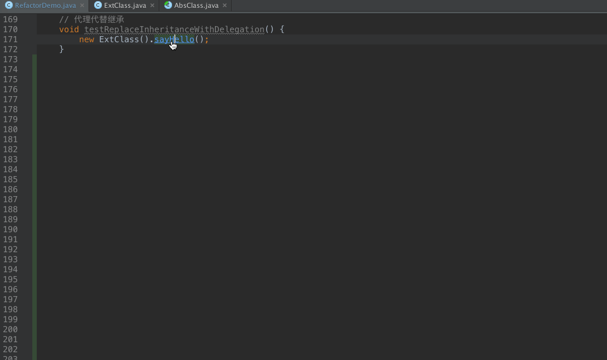

After:

```
public class ExtClass {

    private final AbsClassImpl abs = new AbsClassImpl();

    public void sayHello() {
        abs.sayHello();
    }

    private class AbsClassImpl extends AbsClass {
        @Override
        public void sayHello() {
            System.out.println("hello");
        }
    }
}

    // 代理代替继承
    void testReplaceInheritanceWithDelegation() {
        new ExtClass().sayHello();
    }
```
书上说过，组合由于继承大概说的就是这个意思。

* SafeDelete，安全删除

Before:

```
    // 安全删除
    void testSafeDelete() {
        String unUsedString = "abc";

        unUsedString = getUnUsedString();
        System.out.println(new Date());
    }

    public String getUnUsedString() {
        return unUsedString;
    }
```

After:

```
    // 安全删除
    void testSafeDelete() {
        System.out.println(new Date());
    }
```

这个比较简单，如果某个变量没有使用，那么直接直接删除所有引用这个变量的地方。

* WrapReturnValue，封装返回值

Before:

```
    // 封装返回值
    void testWrapReturnValue() {
        System.out.println(getUserName());
    }

    private String getUserName() {
        return "userName";
    }
```

Gif:

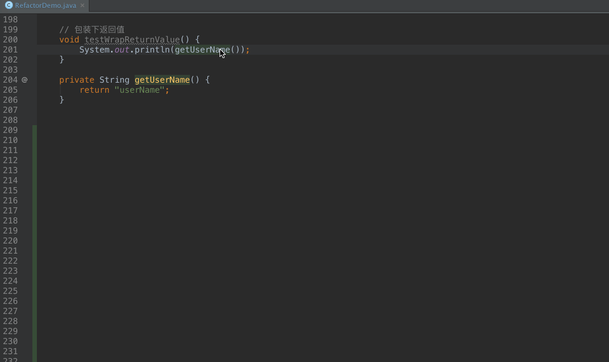

After:

```
    // 包装下返回值
    void testWrapReturnValue() {
        System.out.println(getUserName().getValue());
    }

    private UserInfo getUserName() {
        return new UserInfo("userName");
    }
    
    public class UserInfo {
        private final String value;

        public UserInfo(String value) {
            this.value = value;
        }

        public String getValue() {
            return value;
        }
    }
```

* RemoveMiddleMan，去除中间人

Before:

```
    // 去除中间人
    void testRemoveMiddleMan() {
        OrderManager manager = new OrderManager();
        manager.newOrder("new");
        manager.confirm("confir");
        manager.invalidOrder("invalid");
    }

    public static class OrderManager {
        private List<String> unProcessOrderList;
        private List<String> processedOrderList;

        public OrderManager() {
            unProcessOrderList = new ArrayList<>();
            processedOrderList = new ArrayList<>();
        }

        public void newOrder(String order) {
            unProcessOrderList.add(order);
        }

        public void confirm(String order) {
            unProcessOrderList.remove(order);
            processedOrderList.add(order);
        }

        public void invalidOrder(String order) {
            processedOrderList.remove(order);
        }

        public void display() {
            System.out.println(unProcessOrderList);
            System.out.println(processedOrderList);
        }
    }
```

Gif:

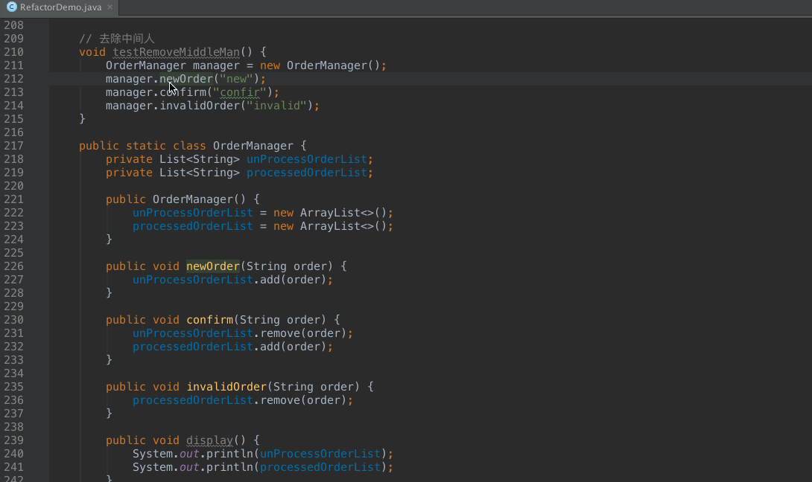

After:

```
    // 去除中间人
    void testRemoveMiddleMan() {
        OrderManager manager = new OrderManager();
        manager.getUnProcessOrderList().add("new");
        manager.confirm("confir");
        manager.getProcessedOrderList().remove("invalid");
    }

    public static class OrderManager {
        private List<String> unProcessOrderList;
        private List<String> processedOrderList;

        public OrderManager() {
            unProcessOrderList = new ArrayList<>();
            processedOrderList = new ArrayList<>();
        }

        public void confirm(String order) {
            unProcessOrderList.remove(order);
            processedOrderList.add(order);
        }

        public void display() {
            System.out.println(unProcessOrderList);
            System.out.println(processedOrderList);
        }

        public List<String> getUnProcessOrderList() {
            return unProcessOrderList;
        }

        public List<String> getProcessedOrderList() {
            return processedOrderList;
        }
    }
```
用途就是，原先OrderManager持有一个List来保存Order，调用方直接使用OrderManager来处理订单，去除中间人的意思就是说，调用法直接获取保存Order的容器，调用方直接自己控制容器。


## 代码抽取

代码抽取在实际使用当中非常有用。

* ExtraMethod，抽取一个方法

Before:

```
    // 抽取一个方法
    void testExtraMethod() {
        Map<String, Integer> map = new HashMap<>();
        map.put("one", 1);
        map.put("two", 2);
        map.put("three", 2);

        System.out.println(map);
    }
```

Gif:

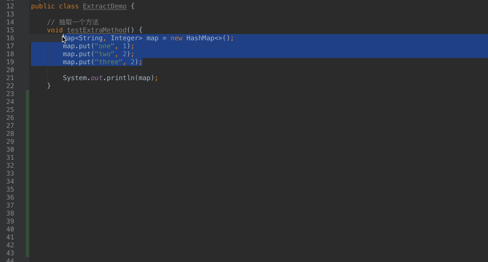

After:

```
    // 抽取一个方法
    void testExtraMethod() {
        Map<String, Integer> map = initMap();

        System.out.println(map);
    }

    @NonNull
    private Map<String, Integer> initMap() {
        Map<String, Integer> map = new HashMap<>();
        map.put("one", 1);
        map.put("two", 2);
        map.put("three", 2);
        return map;
    }
```


* ExtraMethodObject，抽取一个方法到一个对象中

和上面那个差不多，只不过把方法移动到另外一个类中。

Before:

```
    // 抽取一个方法到一个对象中
    void testExtraMethodObject() {
        Map<String, Integer> map = new HashMap<>();
        map.put("one", 1);
        map.put("two", 22);
        map.put("three", 33);

        System.out.println(map);
    }
```

After:

```
    // 抽取一个方法到一个对象中
    void testExtraMethodObject() {
        Map<String, Integer> map = MapUtil.invoke();
        System.out.println(map);
    }
    
    private static class MapUtil {
        private static Map<String, Integer> invoke() {
            Map<String, Integer> map = new HashMap<>();
            map.put("one", 1);
            map.put("two", 22);
            map.put("three", 33);
            return map;
        }
    }   
```


* ExtractParameterObject，抽取若干参数成一个类

这个比较使用，有时候一个方法参数太多，可以把这些参数合并成一个类。

Before:

```
    // 抽取若干参数成一个类
    void testExtractParameterObject() {
        print(100, 200);
    }

    // widht,height --> Size Class
    void print(int width, int height) {
        System.out.println("width = " + width + ", height = " + height);
    }
```

Gif:

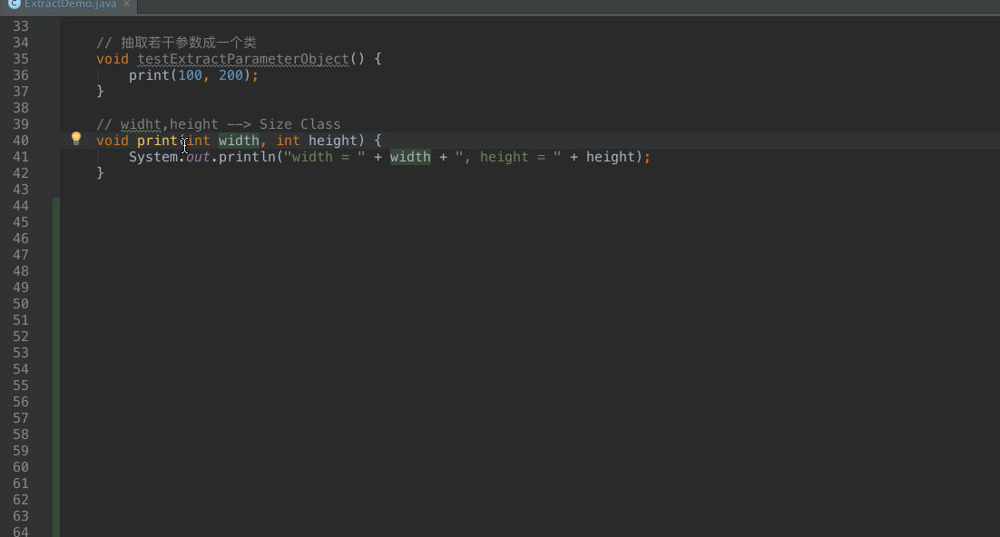

After:

```
    // 抽取若干参数成一个类
    void testExtractParameterObject() {
        print(new Size(100, 200));
    }

    // widht,height --> Size Class
    void print(Size size) {
        System.out.println("width = " + size.getWidth() + ", height = " + size.getHeight());
    }
    
    
public class Size {
    private final int width;
    private final int height;

    public Size(int width, int height) {
        this.width = width;
        this.height = height;
    }

    public int getWidth() {
        return width;
    }

    public int getHeight() {
        return height;
    }
}    
```


* ExtractSuperclass，抽取到父类

Before:

```
    // 抽取到父类
    void testExtractSuperclass() {
        sendEvent("login_success");
    }

    public void sendEvent(Object event) {
        // EventBus.getDefault().send(event);
    }
```

Gif:

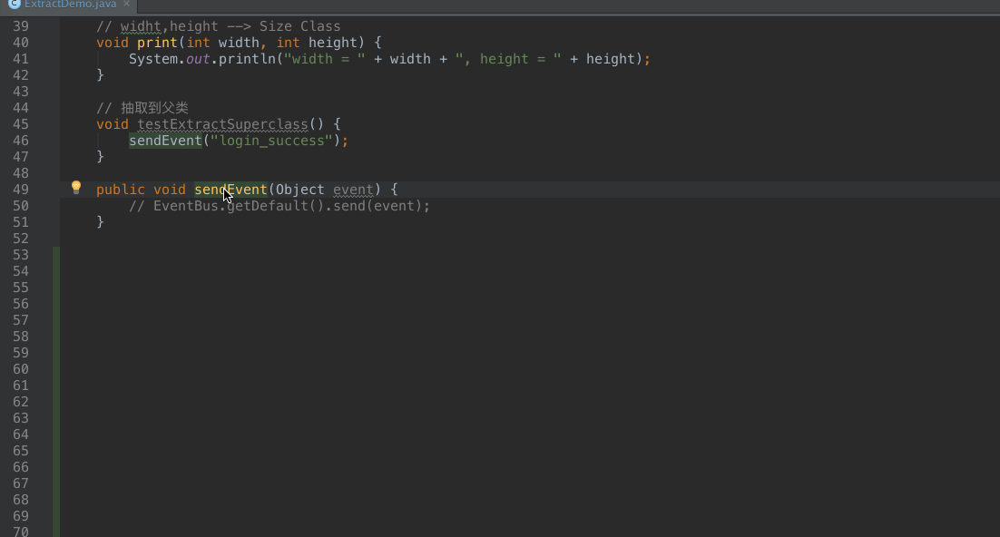

After:

```
public class BaseExtractDemo {
    public void sendEvent(Object event) {
        // EventBus.getDefault().send(event);
    }
}

public class ExtractDemo extends BaseExtractDemo {
    // 抽取到父类
    void testExtractSuperclass() {
        sendEvent("login_success");
    }
}
```

* ExtractConstant，抽取常量

Before:

```
    // 抽取常量
    void testExtractConstant() {
        String email = "admin@123.com";
        String passwd = "1qaz2wsx";

        Bundle bundle = new Bundle();
        bundle.putString("email", email);
        bundle.putString("passwd", passwd);
    }
```

Gif:

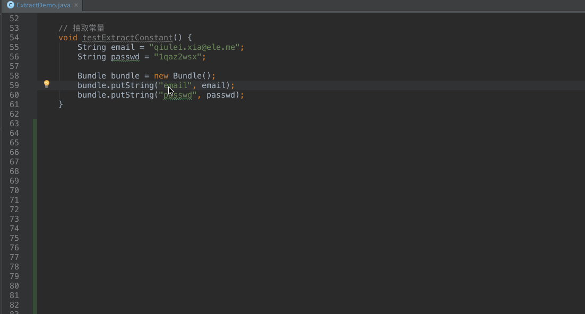

After:

```
    public static final String KEY_EMAIL = "email";
    public static final String KEY_PASSWD = "passwd";
    
    // 抽取常量
    void testExtractConstant() {
        String email = "admin@123.com";
        String passwd = "1qaz2wsx";

        Bundle bundle = new Bundle();
        bundle.putString(KEY_EMAIL, email);
        bundle.putString(KEY_PASSWD, passwd);
    }
```

* ExtractField，抽取成成员变量

Before:

```
    // 抽取成成员变量
    void testExtractField() {
        String testExtractField =  "testExtractField";
        System.out.println(testExtractField);
    }
```
After:

```
    private String testExtractField;
    
    // 抽取成成员变量
    void testExtractField() {
        testExtractField = "testExtractField";
        System.out.println(testExtractField);
    }
```

* ExtractVariable，抽取成变量

Before:

```
    // 抽取成变量
    void testExtractVariable() {
        System.out.println("long name = " + getLoooooooooooooooooooooooooooooooooooooooooooooooooooooongName());
    }

    String getLoooooooooooooooooooooooooooooooooooooooooooooooooooooongName() {
        return "getLoooooooooooooooooooooooooooooooooooooooooooooooooooooongName";
    }
```

Gif:

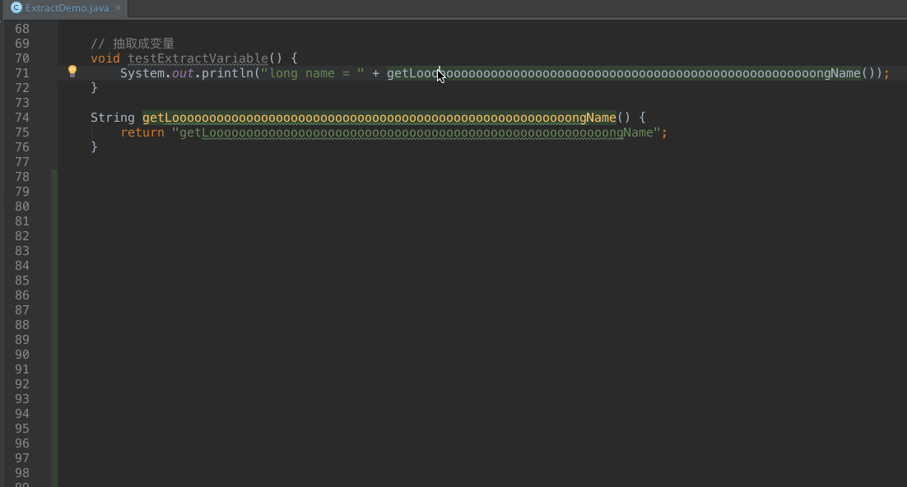

After:

```
    // 抽取成变量
    void testExtractVariable() {
        String name = getLoooooooooooooooooooooooooooooooooooooooooooooooooooooongName();
        System.out.println("long name = " + name);
    }

    String getLoooooooooooooooooooooooooooooooooooooooooooooooooooooongName() {
        return "getLoooooooooooooooooooooooooooooooooooooooooooooooooooooongName";
    }
```

有时候，一行代码写的很长，可以使用这个方法，对代码进行重构。

* ExtractParameter，抽取成方法的参数

Before:

```
    // 抽取成方法的参数
    void testExtractParameter() {
        printHelloString();
    }

    private void printHelloString() {
        String str = "printHello";
        System.out.println(str);
    }
```

Gif:

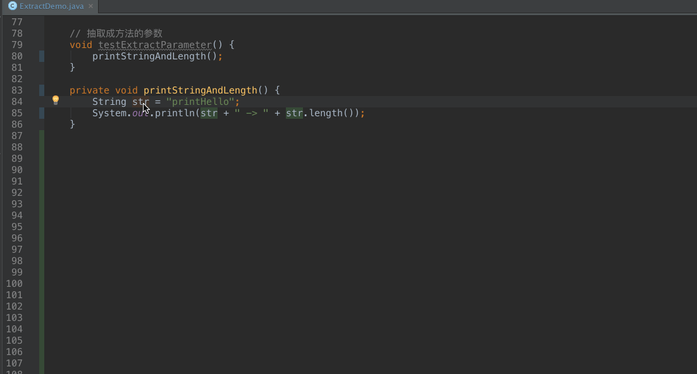

After:

```
    // 抽取成方法的参数
    void testExtractParameter() {
        String str = "printHello";
        printStringAndLength(str);
    }

    private void printStringAndLength(String paramStr) {
        System.out.println(paramStr + " -> " + paramStr.length());
    }
```

## Android资源重构

* ExtractLayout，布局文件抽取

Before:

```
<?xml version="1.0" encoding="utf-8"?>
<android.support.design.widget.CoordinatorLayout xmlns:android="http://schemas.android.com/apk/res/android"
    xmlns:app="http://schemas.android.com/apk/res-auto"
    android:layout_width="match_parent"
    android:layout_height="match_parent"
    android:fitsSystemWindows="true">

    <android.support.design.widget.AppBarLayout
        android:layout_width="match_parent"
        android:layout_height="wrap_content"
        android:theme="@style/AppTheme.AppBarOverlay">

        <android.support.v7.widget.Toolbar
            android:id="@+id/toolbar"
            android:layout_width="match_parent"
            android:layout_height="?attr/actionBarSize"
            android:background="?attr/colorPrimary"
            app:popupTheme="@style/AppTheme.PopupOverlay" />

    </android.support.design.widget.AppBarLayout>

    <include layout="@layout/content_main" />

    <android.support.design.widget.FloatingActionButton
        android:id="@+id/fab"
        android:layout_width="wrap_content"
        android:layout_height="wrap_content"
        android:layout_gravity="bottom|end"
        android:layout_margin="@dimen/fab_margin"
        android:src="@android:drawable/ic_dialog_email" />

</android.support.design.widget.CoordinatorLayout>
```

Gif:

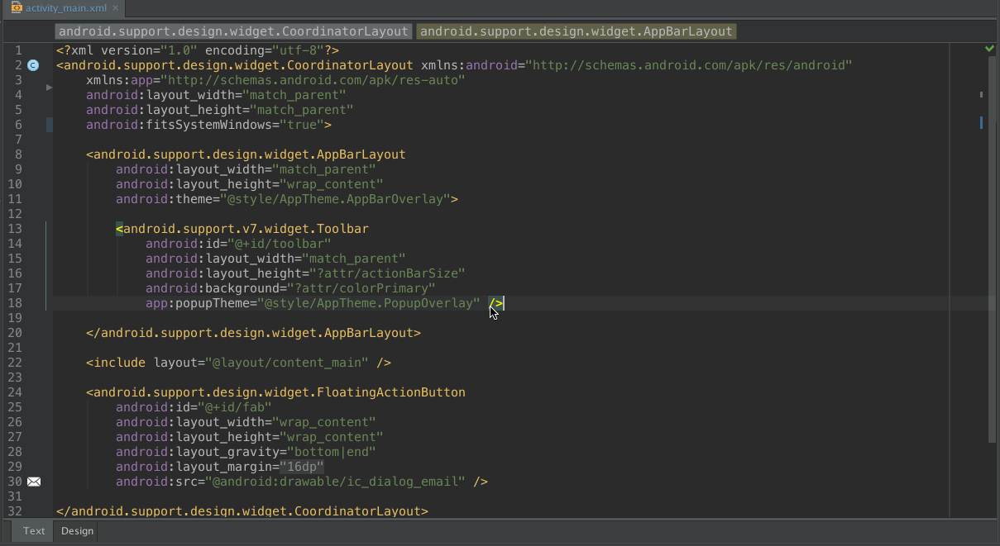

After:

```
<?xml version="1.0" encoding="utf-8"?>
<android.support.design.widget.CoordinatorLayout xmlns:android="http://schemas.android.com/apk/res/android"
    android:layout_width="match_parent"
    android:layout_height="match_parent"
    android:fitsSystemWindows="true">

    <include layout="@layout/view_top" />

    <include layout="@layout/content_main" />

    <include layout="@layout/view_button" />

</android.support.design.widget.CoordinatorLayout>

```

* ExtractStyle，样式抽取

Before:

```
    <TextView
        android:layout_width="wrap_content"
        android:layout_height="wrap_content"
        android:text="Hello World!"
        android:textAlignment="center"
        android:textColor="#f00ff0"
        android:textSize="18sp"
        android:textStyle="bold"
        android:typeface="normal" />
```

Gif:

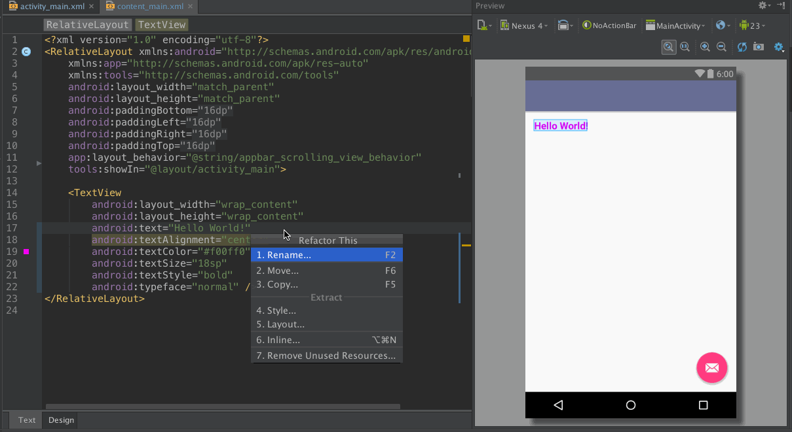

After:

```
    <TextView
        android:layout_width="wrap_content"
        android:layout_height="wrap_content"
        android:text="Hello World!"
        style="@style/my_textview_style" />
        
    <style name="my_textview_style">
        <item name="android:textAlignment">center</item>
        <item name="android:textColor">#f00ff0</item>
        <item name="android:textSize">18sp</item>
        <item name="android:textStyle">bold</item>
        <item name="android:typeface">normal</item>
    </style>        
```
# 综合示例

通过一个示例演示怎么样重构代码，示例是一个Activity里面有个RecyclerView，然后重构代码，演示怎么样分离Adapter,ViewHolder等。

Before:
```
public class StartActivity extends AppCompatActivity {

    @Override
    protected void onCreate(Bundle savedInstanceState) {
        super.onCreate(savedInstanceState);
        setContentView(R.layout.activity_start);
        Toolbar toolbar = (Toolbar) findViewById(R.id.toolbar);
        setSupportActionBar(toolbar);

        RecyclerView recyclerView = (RecyclerView) findViewById(R.id.recyclerView);
        recyclerView.setLayoutManager(new LinearLayoutManager(this));

        final List<String> data = new ArrayList<>();
        for (int i = 0; i < 100; i++) {
            data.add("Text " + (i + 1));
        }

        recyclerView.setAdapter(new RecyclerView.Adapter<MyViewHolder>() {

            @Override
            public MyViewHolder onCreateViewHolder(ViewGroup parent, int viewType) {
                LayoutInflater layoutInflater = (LayoutInflater) parent.getContext().getSystemService(Context.LAYOUT_INFLATER_SERVICE);
                return new MyViewHolder(layoutInflater.inflate(android.R.layout.simple_list_item_1, parent, false));
            }

            @Override
            public void onBindViewHolder(MyViewHolder holder, int position) {
                holder.bind(data.get(position));
            }

            @Override
            public int getItemCount() {
                return data.size();
            }
        });
    }

    class MyViewHolder extends RecyclerView.ViewHolder {

        TextView textView;

        public MyViewHolder(View itemView) {
            super(itemView);
            textView = (TextView) itemView.findViewById(android.R.id.text1);
        }

        void bind(String text) {
            textView.setText(text);
        }
    }
}
```

Gif:


After:
```
public class StartActivity extends AppCompatActivity {

    private RecyclerView recyclerView;
    private List<String> data;

    @Override
    protected void onCreate(Bundle savedInstanceState) {
        super.onCreate(savedInstanceState);
        setContentView(R.layout.activity_start);
        Toolbar toolbar = (Toolbar) findViewById(R.id.toolbar);
        setSupportActionBar(toolbar);

        initData();
        initView();
    }

    private void initData() {
        data = new ArrayList<>();
        for (int i = 0; i < 100; i++) {
            data.add("Text " + (i + 1));
        }
    }

    private void initView() {
        recyclerView = (RecyclerView) findViewById(R.id.recyclerView);
        recyclerView.setLayoutManager(new LinearLayoutManager(this));
        recyclerView.setAdapter(new MyViewHolderAdapter(data));
    }
}

class MyViewHolderAdapter extends RecyclerView.Adapter<MyViewHolder> {

    private List<String> data;

    public MyViewHolderAdapter(List<String> data) {
        this.data = data;
    }

    @Override
    public MyViewHolder onCreateViewHolder(ViewGroup parent, int viewType) {
        return MyViewHolder.newInstance(parent);
    }

    @Override
    public void onBindViewHolder(MyViewHolder holder, int position) {
        holder.bind(data.get(position));
    }

    @Override
    public int getItemCount() {
        return data.size();
    }
}


class MyViewHolder extends RecyclerView.ViewHolder {

    public static final int LAYOUT_ID = android.R.layout.simple_list_item_1;

    @NonNull
    static MyViewHolder newInstance(ViewGroup parent) {
        Context context = parent.getContext();
        LayoutInflater layoutInflater = (LayoutInflater) context.getSystemService(Context.LAYOUT_INFLATER_SERVICE);
        return new MyViewHolder(layoutInflater.inflate(LAYOUT_ID, parent, false));
    }

    TextView textView;

    public MyViewHolder(View itemView) {
        super(itemView);
        textView = (TextView) itemView.findViewById(android.R.id.text1);
    }

    void bind(String text) {
        textView.setText(text);
    }
}
```

# 总结

至此，Android Studio的重构功能讲解完成，由于Android Studio更新很快，很多功能还需要用户去发掘。

有人说，这些都只是些工具而已，最主要的还是能力，但是我觉的『君子生非异也，善假于物也』，好好使用工具，可以偷个懒。